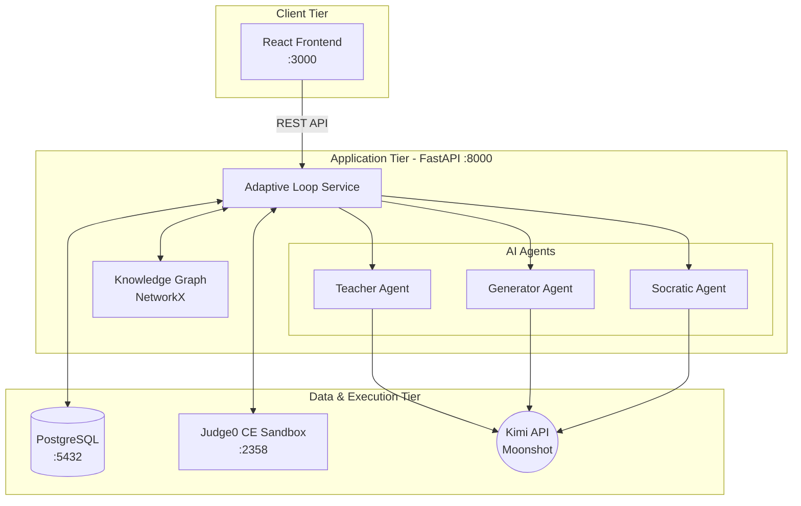

<div align="center">
  <h1>🎓 AdaptLab</h1>
  <p><strong>Adaptive AI-Powered C Programming Tutor with Socratic Guidance</strong></p>
  <p>
    <a href="https://github.com/sankar-chaitanya2025/Adapt-Lab/stargazers"></a>
    <a href="https://github.com/sankar-chaitanya2025/Adapt-Lab/network/members"></a>
    <a href="https://github.com/sankar-chaitanya2025/Adapt-Lab/issues"></a>
    <a href="https://github.com/sankar-chaitanya2025/Adapt-Lab/blob/main/LICENSE"></a>
  </p>
</div>

<br />

**AdaptLab** is a cutting-edge, multi-agent Socratic AI tutor designed for adaptive C programming education. It leverages the power of Large Language Models (via the Kimi API) to create a highly personalized learning experience. 

The system adapts dynamically to each student's strengths and weaknesses using a **Knowledge Graph** and a **Capability Matrix**. It generates tailored problems, securely executes code in a sandboxed environment, and provides guided, Socratic hints that help students think critically through their mistakes—without ever revealing the direct answer.

---

## ✨ Core Features

- 🤖 **Multi-Agent Architecture**: Three specialized AI agents working in harmony (Teacher, Generator, Socratic).
- 🧠 **Dynamic Knowledge Graph**: A DAG-based curriculum that tracks prerequisite concepts and unlocks new ones.
- 📊 **Capability Matrix**: Real-time tracking of student mastery across all programming concepts.
- 🛡️ **Sandboxed Execution**: Secure C code compilation and execution using self-hosted Judge0 CE.
- 💡 **Socratic Guidance**: Never spoon-feeds answers; asks thought-provoking questions to guide students to the solution.
- 🚀 **Full-Stack Application**: FastAPI backend and React frontend with an integrated Monaco code editor.

## 🏗️ System Architecture

AdaptLab is built with a robust, microservices-oriented architecture:



## 🧠 The Multi-Agent System

AdaptLab's intelligence is distributed across three specialized AI agents:

1. 👩‍🏫 **The Teacher Agent (Strategist)**: Analyzes the student's capability matrix and the knowledge graph to determine the optimal next topic and difficulty level. It acts as the curriculum planner.
2. 🛠️ **The Generator Agent (Creator)**: Receives directives from the Teacher and crafts unique, targeted C programming problems, complete with starter code and deterministic test cases.
3. 💬 **The Socratic Agent (Coach)**: Intervenes when a student fails a test case. Instead of providing the correct code, it analyzes the failure and asks 1-3 guiding questions to help the student find the bug themselves.

## 🚀 Getting Started

### Prerequisites

- **Docker** and **Docker Compose** (v2+)
- A **Kimi API key** from the [Moonshot AI Platform](https://platform.moonshot.cn/)
- At least 4GB RAM available for Docker containers

### Quick Start

1. **Clone the repository:**
   ```bash
   git clone https://github.com/sankar-chaitanya2025/Adapt-Lab.git
   cd Adapt-Lab
   ```

2. **Configure the environment:**
   ```bash
   cp .env.example .env
   ```
   *Open `.env` and add your `KIMI_API_KEY` along with a secure `JWT_SECRET`.*

3. **Launch the platform:**
   ```bash
   docker compose up --build
   ```
   *Note: The initial startup may take a few minutes as Docker pulls images, builds containers, and Judge0 CE initializes its compiler toolchain.*

4. **Access the application:**
   - Frontend: `http://localhost:3000`
   - API Docs: `http://localhost:8000/docs`

### Default Service Ports

| Service | Port | Description |
| :--- | :--- | :--- |
| **Frontend** | `3000` | React application served via nginx |
| **Backend** | `8000` | FastAPI server powered by uvicorn |
| **PostgreSQL**| `5432` | Primary database for users and sessions |
| **Judge0 CE** | `2358` | Internal code execution sandbox |

## 📂 Project Structure

```text
Adapt-Lab/
├── docker-compose.yml          # Container orchestration
├── .env.example                # Environment variables template
├── backend/
│   ├── app/
│   │   ├── agents/             # Kimi API Agents (Teacher, Generator, Socratic)
│   │   ├── engine/             # Knowledge graph & Judge0 executor
│   │   ├── models/             # SQLAlchemy ORM models
│   │   ├── routers/            # FastAPI route handlers
│   │   └── services/           # Core business logic & Adaptive Loop
│   ├── curriculum/             # Markdown-based curriculum files
│   └── alembic/                # Database migrations
└── frontend/
    ├── src/
    │   ├── api/                # Axios API client
    │   ├── components/         # Reusable React components
    │   ├── hooks/              # Custom React hooks (useAuth, useSession)
    │   └── pages/              # Application views
    └── nginx.conf              # Reverse proxy configuration
```

## 📚 Curriculum Management

The curriculum is driven by a DAG (Directed Acyclic Graph) built using Markdown files with YAML frontmatter. Adding a new concept is as simple as creating a new `.md` file in the `backend/curriculum/` directory:

```markdown
---
id: memory_allocation
title: Dynamic Memory Allocation
level: 3
prerequisites: [pointers]
unlocks: [linked_lists]
---

Understanding `malloc`, `calloc`, `realloc`, and `free` in C.
```

The system automatically rebuilds the knowledge graph on startup and includes new concepts in the capability matrix.

## 🔐 Environment Variables

| Variable | Description | Default |
| :--- | :--- | :--- |
| `DATABASE_URL` | PostgreSQL connection string | `postgresql+asyncpg://adaptlab:adaptlab@db:5432/adaptlab` |
| `KIMI_API_KEY` | Moonshot AI API key | *(required)* |
| `KIMI_MODEL` | Kimi model name | `moonshot-v1-8k` |
| `JWT_SECRET` | Secret key for JWT signing | *(change in production)* |
| `JUDGE0_URL` | Judge0 CE endpoint | `http://judge0:2358` |

## 🛠️ Technology Stack

- **Frontend**: React (Vite), Tailwind CSS, Monaco Editor
- **Backend**: Python 3.11, FastAPI, SQLAlchemy 2, Alembic
- **AI Integration**: Kimi API (Moonshot AI)
- **Execution Engine**: Judge0 CE
- **Data Structures**: NetworkX (Knowledge Graph)
- **Database**: PostgreSQL 15
- **Deployment**: Docker, Docker Compose

---

<div align="center">
  <p>Built with ❤️ by <strong>Sankar Chaitanya</strong></p>
  <p>Released under the <a href="LICENSE">MIT License</a>.</p>
</div>
